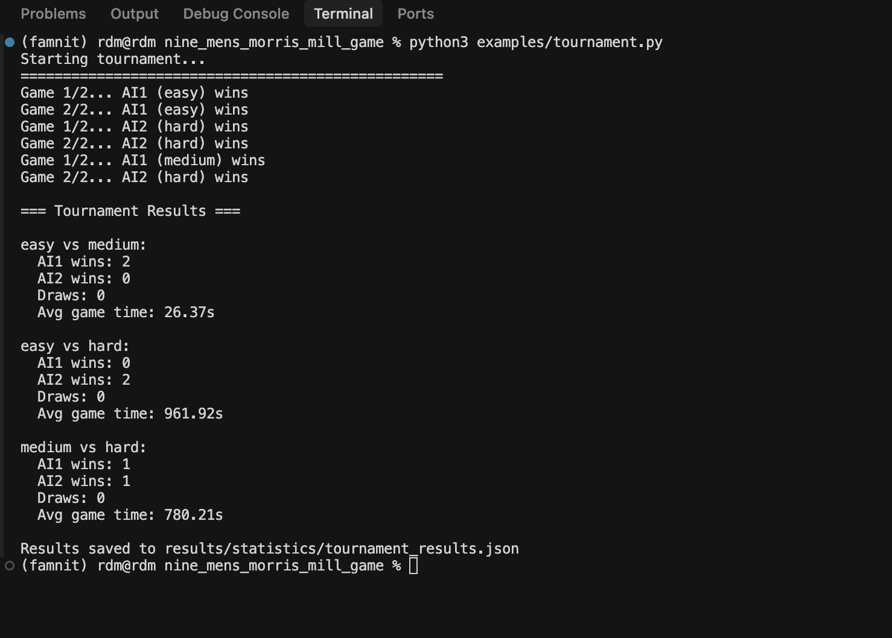
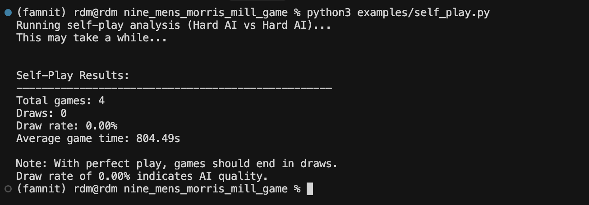

# Instructions for Running Examples

This document provides instructions on how to run the examples for the Nine Men's Morris (Mill) AI implementation.

For More Information and to keep update informations refer to the this repository [here](https://github.com/richarddushime/nine_mens_morris_mill_game)

## Prerequisites

1. Python 3.8 or higher.

2. **Install required packages:**
   ```bash
   pip install -r requirements.txt
   pip install famnit_gym@git+https://github.com/DomenSoberlFamnit/famnit-gym
   ```

   Note: The `requirements.txt` includes dependencies needed for the famnit-gym package (gymnasium, pettingzoo, numpy) and matplotlib for generating plots. All search algorithms (minimax, alpha-beta pruning) are implemented from scratch in Python without using any external AI/search libraries.

## Running Examples

All examples should be run from the project root directory (`nine_mens_morris_mill_game/`).

### 1. Basic AI vs AI Game

Run a game between two AI agents:

```bash
python examples/basic_game.py
```

This will:
- Start a visual game window
- Play a game between Medium AI (Player 1) and Hard AI (Player 2)
- Display moves in the console
- Show the winner when the game ends

**Expected output:** Console messages showing each player's moves and the final winner.

### 2. Human vs AI Gameplay

Play against an AI agent:

```bash
python examples/human_vs_ai.py
```

**Controls:**
- **Mouse click**: Click on board positions to select source and destination
- **SPACE key**: Skip your turn (let AI move)
- **ESC key**: Quit the game

**Instructions:**
1. You are Player 1, AI is Player 2
2. Click on a position to select it as source
3. Click on another position to select it as destination
4. The move will be executed if valid
5. AI will automatically make its move after yours

### 3. Tournament - Difficulty Comparison

Run a tournament between different AI difficulty levels:

```bash
python examples/tournament.py
```

This will:
- Run matches between Easy, Medium, and Hard AI difficulties



- Save results to `results/statistics/tournament_results.json`

**Expected output:** Tournament results showing wins, losses, and draws for each difficulty matchup.

### 4. Search Depth Analysis

Analyze how search depth affects performance:

```bash
python examples/depth_analysis.py
```

This will:
- Test search depths
- Measure average time per move and nodes evaluated
- Generate plots showing:
  - Search time vs depth
  - Nodes evaluated vs depth


- Save plots to `results/plots/depth_analysis.png`

**Note:** This may take several minutes to complete.

**Expected output:** Console output with depth analysis results and saved plot files.

### 5. Self-Play Analysis

Test perfect AI vs perfect AI:

```bash
python examples/self_play.py
```


This will:
- Run  games between two Hard AI agents
- Analyze draw rate (perfect play should result in draws)
- Display statistics

**Expected output:** Statistics showing total games, draws, draw rate, and average game time.

## Contact

For questions or issues, refer to the main README.md
